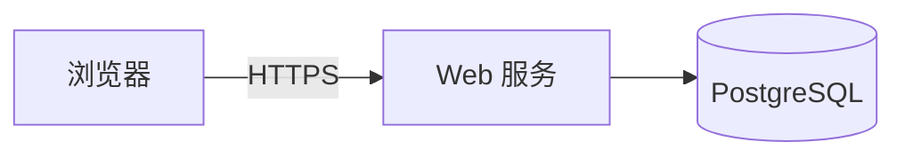

# 十大全景开源项目品类专属 README 完整模板库

> 本文档提供 **10 份可直接复制填空的 README 骨架** + **1 份通用底座** + **逐空判据**。
> **先分类再取模板**：`category_id` 由 `references/category-map.md` §3 的判定算法产出；本文件目录中的"品类 N"与主表的对应关系见文末《品类增量》。
> 渐进式披露：只读与你那一类相关的段落 + 底座，不要通读、也不要跨类拼接。
> 填空约定：`<!-- 判据：… -->` 是"怎样算写好"，`<!-- 反例：… -->` 是常见写坏的样子，`<!-- 可删：… -->` 表示该节在此场景可以整节删掉。三类注释在 GitHub 上渲染时不可见，可放心留在交付物里（也建议作者在写完后删净）。

---

## 目录导航（渐进式披露索引）

- [写之前先备齐：前置事实清单](#写之前先备齐前置事实清单)
- [通用底座：12 节与判据](#通用底座12-节与判据)
- [动态 Badge 速查矩阵](#动态-badge-速查矩阵)
- [🤖 智能体与 AI 核心生态](#-智能体与-ai-核心生态)
  - [品类 1：AI Agent 技能型 (Skill / Tool) 完整模板](#品类-1ai-agent-技能型-skill--tool-完整模板)
  - [品类 2：MCP Server 协议端 (Model Context Protocol) 完整模板](#品类-2mcp-server-协议端-model-context-protocol-完整模板)
  - [品类 3：AI 模型权重与数据集 (Model & Dataset / GGUF) 完整模板](#品类-3ai-模型权重与数据集-model--dataset--gguf-完整模板)
- [🛠️ 终端与系统开发生态](#️-终端与系统开发生态)
  - [品类 4：系统与 CLI 诊断工具型 (CLI / System Utility) 完整模板](#品类-4系统与-cli-诊断工具型-cli--system-utility-完整模板)
  - [品类 5：类库与核心 SDK 型 (Library / SDK) 完整模板](#品类-5类库与核心-sdk-型-library--sdk-完整模板)
  - [品类 6：基础设施代码与配置集 (IaC / Dotfiles / Helm) 完整模板](#品类-6基础设施代码与配置集-iac--dotfiles--helm-完整模板)
- [🎨 前端与交互应用生态](#-前端与交互应用生态)
  - [品类 7：前端与多媒体生成型 (Frontend / Media Generator) 完整模板](#品类-7前端与多媒体生成型-frontend--media-generator-完整模板)
  - [品类 8：浏览器扩展与插件型 (Browser Extension / MV3) 完整模板](#品类-8浏览器扩展与插件型-browser-extension--mv3-完整模板)
  - [品类 9：完整应用与 Web 服务型 (Fullstack App) 完整模板](#品类-9完整应用与-web-服务型-fullstack-app-完整模板)
- [📚 知识与内容生态](#-知识与内容生态)
  - [品类 10：知识库与 Awesome 精选清单 (Curated / Awesome List) 完整模板](#品类-10知识库与-awesome-精选清单-curated--awesome-list-完整模板)
- [多平台现代终端下载与安装表格集合 (2026 标准)](#多平台现代终端下载与安装表格集合-2026-标准)

---

## 写之前先备齐：前置事实清单

**没有这 5 样就不要开始写 README**（缺哪样先补哪样，或用 `未验证` 如实标注）：

| # | 必须有 | 为什么 |
|---|---|---|
| 1 | **一条能跑通的命令**（从空目录开始跑通，不是"我记得能跑"） | 首屏唯一硬通货；跑不通的 README 比没有 README 更伤信任 |
| 2 | **一段真实输出**（复制粘贴，不要手写"看起来像"的输出） | 让读者知道"成功长什么样"，也是你自测的证据 |
| 3 | **一张真实结果图**（截图/照片，非设计稿；必须有 alt 文本） | 15 秒内让人理解产物形态 |
| 4 | **一个失败案例 + 处置方法** | 决定陌生人来不来开第二现场；排障表比特性表更有说服力 |
| 5 | **支持范围声明**（测过哪些平台/版本，没测的写"未验证"） | 避免"应该能在 Linux 上跑"这类隐性谎言 |

## 通用底座：12 节与判据

所有品类共用。**硬性只有 3 节**（★），其余按项目取用；不设字数与章节数量要求——只查"内容是否真存在"。

| 节 | 判据（怎样算写好） | 硬性 |
|---|---|:--:|
| 1 首屏 | 一句话价值 + 1 张带 alt 的结果图 + 1 条复制即运行命令，三者都在渲染首屏内 | ★ |
| 2 这是什么/为什么 | ≤3 段，含"原来多麻烦 / 现在少几步"对比，禁止形容词堆叠 | |
| 3 安装 | ≥2 条路径（推荐 + 离线或手动），每条给**成功判据** | |
| 4 快速开始 | 最小示例 + **真实输出代码块**；输入数据来源写清 | ★ |
| 5 能力/用法表 | 每行给"命令或 API 签名"，不给空泛特性名 | |
| 6 工作原理 | ≥1 张图（Mermaid/SVG/ASCII）+ alt；说明数据流或调用顺序 | |
| 7 配置与兼容性 | 配置表（名称/默认/必填/影响）+ 平台版本矩阵，未测显式写"未验证" | |
| 8 排障 | ≥3 条"现象 → 原因 → 处置"，至少覆盖安装失败、权限、网络三类 | ★ |
| 9 已知限制 | 明确写"不做什么"、性能/规模边界、数据与隐私注意 | |
| 10 项目结构 | 目录树 + 每个目录一行说明（monorepo 换成"分产物入口表"） | |
| 11 贡献·支持·引用 | 三行：怎么提 PR、卡住去哪问（Issue/Discussions/其它）、如何引用（`CITATION.cff`） | |
| 12 许可与致谢 | 许可**按资产类型**给 SPDX（代码/文档/图/字体/数据），第三方素材署名入口 | |


---

## 动态 Badge 速查矩阵

```markdown
<!-- License 徽章：许可文字与链接目标由 category-map 的"许可默认"列派生，不要写死 MIT；
     非代码资产（文档/图像/字体/数据）需在徽章或 §12 分许可表中体现 -->
[](LICENSE)

<!-- 动态 Release 徽章（自动读取最新 Tag） -->
[](https://github.com/{owner}/{repo}/releases)

<!-- 包管理器动态版本 (npm / PyPI / Crates) -->
[](https://www.npmjs.com/package/{pkg-name})
[](https://pypi.org/project/{pkg-name}/)
[](https://crates.io/crates/{pkg-name})

<!-- CI 状态徽章 -->
[](https://github.com/{owner}/{repo}/actions)

<!-- 平台支持徽章：链接指向"兼容性"章节锚点，不要指向项目里未必存在的 SKILL.md -->
[](#兼容性)
<!-- Stars 徽章：新仓库冷启动无信号量，建议省略；要用就放正文末尾，别占首屏 -->
```

---

# 🤖 智能体与 AI 核心生态

## 品类 1：AI Agent 技能型 (Skill / Tool) 完整模板

```markdown
# 📦 项目名称 / Project Name

<div align="center">

<!-- 判据：首屏三件事缺一不可 —— ①一句话价值（谁+做什么+得到什么）②一条复制即可运行的命令 ③一张带 alt 的结果图；只喊口号视为未完成 -->
**一句话中文功能与价值描述**

**One-liner English description of core capabilities and benefits.**

[](LICENSE)
[](https://github.com/{owner}/{repo}/releases/latest)
[](SKILL.md)
[](https://github.com/{owner}/{repo}/stargazers)

[English](README.en.md) | [中文](README.md)

</div>

---

## 📖 这是什么？

<!-- 判据：2~3 段，第一段必须含"谁 + 在什么场景 + 原来多麻烦 + 现在少几步"；只写特性名不算 -->
<!-- 反例："本技能用于帮助用户更好地准备开源项目，功能强大。" -->
<!-- 可删：若首屏一句话已能自解释，本节可压成 1 段 -->
说明该技能解决的具体痛点场景与核心价值。

## ✨ 核心特性

<!-- 判据：每行"功能说明"必须能指向一处可验证行为（文件、命令或检查项），不能是形容词 -->
| 核心特性 | 功能说明（可验证） | 带来价值 |
|---|---|---|
| **先审后改** | 改动前输出 diff 与理由，获确认后才写文件 | 不怕被覆盖，敢把已有项目交出来 |
| **发布门禁** | P0 检查（凭据/许可/可复现）失败即阻断公开 | 不会把带密钥的仓库推上网 |

---

## 🚀 快速开始

### 方式 A：把一句话发给任意 Agent（最推荐、最通用）

> 请安装 {repo} 技能：克隆 `https://github.com/{owner}/{repo}` 到你的 skills 目录（如 `~/.claude/skills/{repo}` 或 `~/.agents/skills/{repo}`），并确认安装成功。

### 方式 B：GitHub CLI（Public Preview，先 `gh skill --help` 确认）

```bash
# --pin 锁定版本，便于复现安装（官方还有 gh skill publish / search / list）
gh skill install {owner}/{repo} {name} --agent claude-code --scope user --pin
```

### 方式 C：多平台手动安装

| 平台 | 安装命令 |
|---|---|
| **Claude Code** | `git clone https://github.com/{owner}/{repo}.git ~/.claude/skills/{repo}` |
| **Codex** | `git clone https://github.com/{owner}/{repo}.git ~/.codex/skills/{repo}` |
| **Cursor** | `git clone https://github.com/{owner}/{repo}.git ~/.cursor/skills/{repo}` |
| **通用 Agents** | `git clone https://github.com/{owner}/{repo}.git ~/.agents/skills/{repo}` |

---

## 🔒 安全与隐私原则
<!-- 判据：本节要写"能力边界"（会写哪些路径、会执行什么命令、如何回滚、凭据在哪一步才需要），不是写"我们重视安全"的态度话 -->

- **纯只读 / 先审后改**：说明本技能会写哪些路径、会不会执行命令、失败时如何回滚。
- **凭据边界**：说明本地整理为何不需要 token，只有哪一步需要授权（写清"哪一步"）。

## 📥 下载与获取

| 方式 | 命令 / 链接 |
|---|---|
| **HTTPS** | `git clone https://github.com/{owner}/{repo}.git` |
| **SSH** | `git clone git@github.com:{owner}/{repo}.git` |
| **ZIP** | [下载 ZIP](https://github.com/{owner}/{repo}/archive/refs/heads/main.zip) |
| **单文件** | `curl -O https://raw.githubusercontent.com/{owner}/{repo}/main/SKILL.md` |

## 📄 开源协议

本项目采用 [MIT 许可证](LICENSE) 开源。
```

---

## 品类 2：MCP Server 协议端 (Model Context Protocol) 完整模板

```markdown
# 🔌 项目名称 MCP Server / Project MCP Server

<div align="center">

**专为 AI 助手打造的 Model Context Protocol 协议服务端 · 开箱即用 · 纯净安全**

[](LICENSE)
[](https://www.npmjs.com/package/{pkg-name})
[](https://modelcontextprotocol.io)

</div>

---

## 📖 这是什么？

这是一个基于 Model Context Protocol (MCP) 标准构建的服务端程序，向 Claude Desktop、Cursor、Cline、VS Code 等 AI 客户端暴露工具、资源与提示词模板。

<!-- 判据：本节之后必须能让人"连上"——安装 + 至少 1 家客户端配置 + 1 次成功调用的输出 -->
<!-- 边界：本类不含 Agent Skill（那是品类 1）；若同时提供 SKILL.md 封装，按 category-map 打 monorepo 旗标并写分产物入口表 -->

## 📥 安装与运行

| 运行时 | 命令 | 成功判据 |
|---|---|---|
| Node（推荐免装运行） | `npx -y {pkg-name}` | 进程启动并等待 stdio，无 `ERR_MODULE_NOT_FOUND` |
| Python（推荐免装运行） | `uvx {pkg-name}` | 同上，无 `ModuleNotFoundError` |
| 本地开发 | `npm run dev` | 变更后自动重载；见下节 Inspector 调试 |

---

## ⚙️ 客户端快速配置 (Configuration)

### 1. Claude Desktop 配置
在你的 `claude_desktop_config.json` 中加入：

```json
{
  "mcpServers": {
    "{server-name}": {
      "command": "npx",
      "args": ["-y", "{pkg-name}"],
      "env": {
        "API_KEY": "your_api_key_here"
      }
    }
  }
}
```

### 2. Cursor / Cline / VS Code 配置
在 MCP 客户端配置中添加：
- **Name**: `{server-name}`
- **Transport**: `stdio`
- **Command**: `npx -y {pkg-name}`（Node）或 `uvx {pkg-name}`（Python）

---

## 🛠️ 暴露的能力清单 (Exposed Capabilities)

### 1. Tools (可执行工具列表)
<!-- 判据：必须写"出错时返回什么"与是否有副作用（写文件/发请求），否则调用方无法安全重试 -->
| 工具名称 | 输入参数 | 成功返回 | 错误语义与副作用 |
|---|---|---|---|
| `tool_name` | `{ query: string, limit?: number }` | `JSON` | 参数非法返回 `{error:{code:"invalid_input"}}`；无副作用 |

### 2. Resources (只读上下文资源)
| 资源 URI 模式 | MIME 类型 | 说明 |
|---|---|---|
| `{server-name}://data/status` | `application/json` | 实时状态数据源 |

### 3. Prompts (预设提示词模板)
| 模板名称 | 参数 | 说明 |
|---|---|---|
| `analyze_report` | `{ report_id: string }` | 自动生成深度分析提示词 |

---

## 🚀 本地调试与开发

```bash
# 启动开发模式 (stdio 管道)
npm run dev

# 使用 MCP Inspector 进行交互式调试
npx @modelcontextprotocol/inspector npx {pkg-name}
```
```

---

## 品类 3：AI 模型权重与数据集 (Model & Dataset / GGUF) 完整模板

```markdown
# 🧠 模型名称 / Model Name (GGUF & Safetensors)

<div align="center">

**高性能量化开源大模型 · 支持多硬件档位 · 低显存极速推理**

<!-- 边界：本骨架只覆盖【模型权重】。数据集请按 category-map `dataset` 的增量写：来源与采集方法、再分发许可、去标识与撤回、schema + 一行样例、切分与版本、偏倚声明 -->
<!-- 判据：任何跑分都必须给复现命令与评测环境（harness 版本、commit、随机种子、硬件、采样参数），否则删表 -->
<!-- 判据：许可必须写清"跟随基础模型许可链"，不得默认 MIT -->

[](https://huggingface.co/{owner}/{repo})
[](https://ollama.com/{owner}/{repo})
[](LICENSE)

</div>

---

## ⚡ 极速开始 (One-liner Quickstart)

```bash
# 🚀 Ollama 一键拉取并运行
ollama run {owner}/{repo}

# 📦 llama.cpp 极速推理
llama-cli -m {model-name}-q4_k_m.gguf -p "你好，请做个自我介绍"
```

---

## 📊 硬件显存配置与量化矩阵 (VRAM Matrix)

| 量化版本 (Quant) | 文件大小 | 推荐显存 (VRAM) | 适用场景 |
|---|---|---|---|
| **Q4_K_M** (推荐) | ~4.2 GB | **6 GB+** (RTX 3060/4060) | 日常开发、平衡速度与精度 |
| **Q5_K_M** | ~5.1 GB | **8 GB+** | 高精度推理要求 |
| **Q8_0** | ~7.8 GB | **12 GB+** | 接近全精度基线 |
| **FP16** | ~14.5 GB | **24 GB+** (RTX 3090/4090) | 原始模型权重 |

---

## 🏆 基准评测排行榜 (Benchmark Leaderboard)

| 评测集 (Benchmark) | 本模型跑分 | 基线模型对比 | 提升幅度 |
|---|---|---|---|
| **MMLU (综合知识)** | **74.8** | 71.2 | +3.6% |
<!-- 示例（复现）：`lm_eval --model hf --model_args pretrained={repo},dtype=auto --tasks mmlu --seed 0`；
     基线同命令、同种子、同硬件；报告需注明样本数与置信区间 -->
| **GSM8K (数学推理)** | **82.3** | 77.5 | +4.8% |
| **HumanEval (代码能力)** | **68.4** | 62.1 | +6.3% |

---

## 💬 提示词模版 (Prompt Format - ChatML)

```text
<|im_start|>system
你是一个专业的技术助手。<|im_end|>
<|im_start|>user
{user_query}<|im_end|>
<|im_start|>assistant
```
```

---

# 🛠️ 终端与系统开发生态

## 品类 4：系统与 CLI 诊断工具型 (CLI / System Utility) 完整模板

```markdown
# 🛠️ 工具名称 / Tool Name

<div align="center">

**专治系统级疑难杂症 · 纯只读探测 · 毫秒级数据说话 · 零破坏安全保障**

[](LICENSE)
[](https://github.com/{owner}/{repo}/releases/latest)
[](#兼容性)
<!-- 判据：徽章链接必须指向本项目真实存在的小节（如 ## 兼容性）；无该小节就删掉链接，不要指向别人项目里未必存在的 SKILL.md -->

</div>

---

## 📖 痛点解构

<!-- 判据：恰好 3 条；每条 = 可观测现象 + 量化数字 + 用户代价 + 本工具用哪个输出证明；无数字即视为没写 -->
<!-- 反例："网络很慢，影响体验" —— 无观测、无量化、无证据 -->
描述 3 个典型疑难用户痛点（如开网页卡死 3 秒、上行吃满、休眠唤醒延迟）。

## 📊 分层架构流程图

```
[输入: 用户遇到系统变慢 / 故障]
                 │
      [第 1 层: 物理与硬件层诊断]
                 │
      [第 2 层: 协议与系统调度诊断]
                 │
      [第 3 层: 后台资源与瓶颈定位]
                 │
      [输出: 确凿毫秒级证据链 + 官方治理建议]
```

## 🎯 常见疑难杂症实战速查表

| 典型现象 | 根因分类 | 核心排查命令 | 官方治理方案 |
|---|---|---|---|
| **现象 1** | 根因 1 | `命令 1` | 解决对策 1 |
| **现象 2** | 根因 2 | `命令 2` | 解决对策 2 |

## 📺 一段真实输出（不是示意图）

<!-- 判据：必须是从终端直接复制的文本，含提示符与耗时；改动数字/路径也要保留真实形态 -->
```console
$ {tool} probe --latency --samples 40
sample  dns=18ms  tcp=9ms  tls=31ms  ttfb=44ms   (40/40 ok)
p50 ttfb=44ms   p95 ttfb=132ms   worst=287ms  @ 2026-09-19 12:04
→ 结论：TLS 握手抖动集中在代理侧（见 --verbose 的 handshake 明细）
```

## 🧭 我该用哪种安装方式

| 你的情况 | 选 |
|---|---|
| 只想跑一次、不想污染环境 | A（`uvx`）或 B（`npx`） |
| 要天天用、希望 `PATH` 里有命令 | A 的 `uv tool install` / B 的 `npm i -g` |
| 公司机器不能装东西、需离线 | D（下载 Release 预编译包 + 校验和） |
| 需要在 CI 里用 | D（固定版本号，勿用 `latest`/`main.zip`） |

---

## 兼容性

| 平台 | 状态 |
|---|---|
| Windows 10 / 11 | 已验证 |
| macOS / Linux | 未验证 |

<!-- 判据：只列你真的跑过的平台；没测过的写"未验证"而不是删掉该行 -->

## 📥 现代终端安装与运行方式 (按技术栈针对性选择)

### 选项 A：Python 现代环境运行 (推荐 uv / pipx)
```bash
# 🚀 uvx 免安装即时秒开 (最推荐)
uvx {pkg-name}

# 📦 uv tool 持久隔离安装
uv tool install {pkg-name}

# 传统 pipx 隔离安装
pipx install {pkg-name}
```

### 选项 B：Node.js / 前端环境运行
```bash
# 🚀 npx / pnpm / bun 免安装即时运行
npx {pkg-name}
pnpm dlx {pkg-name}
bunx {pkg-name}

# 全局安装
npm install -g {pkg-name}
```

### 选项 C：跨平台单行脚本直装（**先审后跑**，别直接把管道当默认姿势）
```bash
# Linux / macOS：先下载、看一眼、再执行；有条件就校验 SHA-256
curl -fsSL https://{domain}/install.sh -o install.sh && less install.sh && sh install.sh

# Windows PowerShell：同理先落盘审阅
irm https://{domain}/install.ps1 | Out-File install.ps1; notepad install.ps1; .\install.ps1
```
<!-- 判据：给出校验和文件或 Release 资产链接；写清脚本会改哪些路径、是否需要管理员权限、如何卸载 -->

### 选项 D：系统级包管理器
| 操作系统 | 推荐包管理器 | 安装命令 |
|---|---|---|
| **Windows** | **Winget** | `winget install {owner}.{repo}` |
| **Windows** | **Scoop** | `scoop install {repo}` |
| **macOS / Linux** | **Homebrew** | `brew install {owner}/tap/{repo}` |
| **跨平台** | **Release 预编译包** | [下载 .exe / .zip / .tar.gz 资产](https://github.com/{owner}/{repo}/releases) |
```

---

## 品类 5：类库与核心 SDK 型 (Library / SDK) 完整模板

```markdown
# 📚 SDK 名称 / Library Name

<div align="center">

**轻量、高效、类型安全的跨平台核心 SDK · 零外部冗余依赖**

[](https://www.npmjs.com/package/{pkg-name})
[](https://pypi.org/project/{pkg-name}/)
[](https://crates.io/crates/{pkg-name})

</div>

---

## ⚡ 5 行极简极速示例 (Hello World)

```typescript
import { createClient } from '{pkg-name}';

const client = createClient({ apiKey: process.env.API_KEY });
const result = await client.execute({ prompt: "Hello World" });
console.log(result.data);
```

<!-- 判据：示例之后必须给真实返回值；库类 README 的第一价值就是"调用形状 + 返回形状" -->
```json
{ "data": "Hello World", "usage": { "prompt_tokens": 3, "completion_tokens": 12 }, "latency_ms": 412 }
```

## 🧯 错误语义

| 情况 | 抛出 | 建议处置 |
|---|---|---|
| 未配置密钥 | `MissingCredentials` | 设 `API_KEY` 环境变量，勿写进代码 |
| 网络超时 | `TimeoutError`（默认 30s） | 用 `client.execute({ timeout: 60_000 })` 或加重试 |
| 上游限流 | `RateLimited`（含 `retryAfterMs`） | 按 `retryAfterMs` 退避 |

## 📥 安装

| 包管理器 | 命令 |
|---|---|
| **npm** | `npm install {pkg-name}` |
| **pnpm** | `pnpm add {pkg-name}` |
| **bun** | `bun add {pkg-name}` |
| **pip** | `pip install {pkg-name}` |
| **cargo** | `cargo add {pkg-name}` |

## 📖 API 参数表格

| 方法 | 参数 | 返回值 | 说明 |
|---|---|---|---|
| `execute(options)` | `RequestOptions` | `Promise<Response>` | 执行核心请求 |
```

---

## 品类 6：基础设施代码与配置集 (IaC / Dotfiles / Helm) 完整模板

```markdown
# 🏗️ 基础设施模块 / Cloud Infrastructure

<div align="center">

**生产级声明式基础设施模块 · 版本约束明确 · 变更可预览**

<!-- 边界：本骨架只覆盖【Terraform 模块】。 -->
<!-- Helm Chart 必写：values 契约表、`helm lint`/`ct lint`、默认资源与 SLO、升级与回滚（helm upgrade --atomic / helm rollback） -->
<!-- dotfiles/devcontainer 必写：密钥绝不入库（见 scripts/secret-rules.json 的 .env 拦截）、机器绑定与 stow 流程、bootstrap 失败的手动步骤、"这不是可分发软件"声明 -->

[](https://terraform.io)
[](https://kubernetes.io)

</div>

---

## 🚀 一键自动化部署 (Quick Start)

```bash
# 1. 初始化模块
terraform init

# 2. 预览计划
terraform plan -out=tfplan

# 3. 执行应用
terraform apply tfplan
```

---

## 🗺️ 资源拓扑架构与清单

```
[Internet] ──> [Cloudflare / ALB] ──> [EKS / K8s Cluster]
                                              │
                                   ┌──────────┴──────────┐
                                   ▼                     ▼
                             [App Pods]            [PostgreSQL RDS]
```

## ⚙️ 核心参数配置清单 (`variables.tf` / `values.yaml`)

| 参数名 | 类型 | 必填 | 默认值 | 说明 |
|---|---|---|---|---|
| `cluster_name` | `string` | 是 | - | Kubernetes 集群名称 |
| `node_count` | `number` | 否 | `3` | 工作节点副本数 |
| `enable_ssl` | `bool` | 否 | `true` | 是否自动开启 Let's Encrypt 证书 |
```

---

# 🎨 前端与交互应用生态

## 品类 7：前端与多媒体生成型 (Frontend / Media Generator) 完整模板

```markdown
# 🎬 项目名称 / Media Generator

<div align="center">

**高质量多媒体生成与渲染引擎 · 支持多画布比例 · 宽泛框架兼容**

<!-- 边界：本骨架面向【产出媒体的工具】。若是组件库/站点（产给人看而非文件），改用：Storybook/文档站入口、SSR 与构建产物、键盘可达性与对比度 -->

[](LICENSE)
[](https://www.npmjs.com/package/{pkg-name})

</div>

---

## 🎨 视觉效果预览 (Gallery)


<!-- 判据：必须有真实产物图/视频（非设计稿），每张带 alt；图片走 Git LFS 或 Release 资产，勿塞进仓库历史 -->

## 📐 画布多比例适配矩阵

| 画布比例 | 分辨率 | 适用场景 |
|---|---|---|
| **16:9** | 1920x1080 | 横屏视频 / 讲座演练 |
| **9:16** | 1080x1920 | 手机竖屏短视频 |
| **4:3** | 1440x1080 | 传统复古演示 |
| **3:4** | 1080x1440 | 社交图文短视频 |

## 📦 依赖兼容性区间

```json
{
  "dependencies": {
    "react": "^18.2.0 || ^19.0.0",
    "react-dom": "^18.2.0 || ^19.0.0",
    "remotion": "^4.0.0"
  },
  "engines": {
    "node": ">=18.0.0"
  }
}
```

## 🚀 极速开始

```bash
npm install {pkg-name}
pnpm add {pkg-name}
bun add {pkg-name}
```
```

---

## 品类 8：浏览器扩展与插件型 (Browser Extension / MV3) 完整模板

```markdown
# 🧩 扩展名称 / Browser Extension

<div align="center">

**现代轻量级浏览器效率扩展 · 零隐私追踪 · Manifest V3 标准**

[](https://chromewebstore.google.com/detail/{id})
[](https://microsoftedge.microsoft.com/addons/detail/{id})
[](LICENSE)

</div>

---

## 📥 安装方式

### 方式 A：应用商店安装（最推荐）
- [前往 Chrome 网上应用店一键安装](https://chromewebstore.google.com/detail/{id})
- [前往 Edge 外接程序商店一键安装](https://microsoftedge.microsoft.com/addons/detail/{id})

### 方式 B：开发者模式离线加载
1. 在 [Releases 页面](https://github.com/{owner}/{repo}/releases) 下载最新的 `extension.zip` 并解压；
2. 打开 Chrome / Edge 浏览器，访问 `chrome://extensions`；
3. 打开右上角的 **“开发者模式”** 开关；
4. 点击左上角 **“加载已解压的扩展程序”**，选择解压出的文件夹即可。

---

## 🔒 Manifest V3 权限用途声明

| 申请权限 (Permission) | 使用原因与场景说明 |
|---|---|
| `storage` | 仅在本地持久化存储用户的自定义主题与偏好设置 |
| `activeTab` | 仅在用户主动点击扩展图标时读取当前页面标题与 URL |
| `contextMenus` | 在右键菜单中添加快捷搜索动作 |

> 🛡️ **隐私承诺**：本扩展绝不上传用户浏览历史或个人数据；所有偏好只存 `chrome.storage.local`。

## 🧪 兼容性

| 宿主 | 已验证版本 | 状态 |
|---|---|---|
| Chrome / Edge | 130+ | 已验证 |
| Firefox | — | **未验证** |

## 📦 更新与失效

- 更新走商店（推荐）；离线 zip 需自行覆盖并重启浏览器。
- 站点改版导致选择器失效时：先看 [已知问题](../../issues?q=is%3Aissue+label%3Asite-breakage)，附站点 URL 与控制台报错。

<!-- 判据：开发者模式加载必须提示"只加载你信任的来源，加载后会获得你账户的浏览器数据访问面" -->
<!-- 判据：权限声明表每一项都要回答"数据是否离开本机"，商店审核与用户信任都看这一列 -->
```

---

## 品类 9：完整应用与 Web 服务型 (Fullstack App) 完整模板

```markdown
# 🌐 应用名称 / Web Service

<div align="center">

**现代化全栈 Web 应用 · 一键部署 · 开箱即用**

[](https://vercel.com/new/clone?repository-url=https://github.com/{owner}/{repo})
[](https://railway.app/template)

</div>

---

## 🚀 一键云端部署与 Docker

```bash
# Docker 运行
docker run -d -p 3000:3000 --env-file .env.production ghcr.io/{owner}/{repo}:1.2.3   # 固定版本号；勿用 latest（不可复现、回滚困难）

# Docker Compose
docker compose up -d
```

## ⚙️ 环境变量清单 (`.env.example`)

| 变量名 | 必填 | 默认值 | 说明 |
|---|---|---|---|
| `DATABASE_URL` | 是 | - | PostgreSQL 连接串（`docker compose logs db` 或云厂商控制台） |
| `SESSION_SECRET` | 是 | - | `openssl rand -hex 32`；多副本必须同值 |
| `PORT` | 否 | `3000` | 与反代一致即可 |

## 🧱 架构


<!-- alt：请求经 Web 服务落到数据库；当前无异步任务队列 -->

## 🔁 迁移、回滚与备份

```bash
docker compose exec app npm run migrate:up      # 升级
docker compose exec app npm run migrate:down    # 回滚一个版本
pg_dump "$DATABASE_URL" | gzip > backup.sql.gz  # 升级前必备份
```

## 🩺 健康检查与排障

| 现象 | 原因 | 处置 |
|---|---|---|
| 反代 502 + 日志 `connection refused 5432` | DB 未就绪或 URL 错 | 先 `docker compose up -d db`，再核对 `DATABASE_URL` |
| 登录后立刻被登出 | 多副本 `SESSION_SECRET` 不一致 | 统一为同一值 |
| 上传返回 413 | 反代 body 限制 | 调 `client_max_body_size` 或平台限制 |

健康检查：`curl -fsS localhost:3000/healthz` → `{"status":"ok","db":"up"}`

## 🚧 已知限制

- 单实例设计，多副本未做分布式锁；水平扩展前请读 `docs/scaling.md`
- 仅测试 PostgreSQL 16；MySQL **未验证**
- 无端到端加密，勿存放受限数据

## 🤝 支持 · 贡献 · 引用

卡住了？开 [Issue](../../issues) 或到 [Discussions](../../discussions) 提问；贡献前读 [CONTRIBUTING.md](CONTRIBUTING.md)。
```

---

# 📚 知识与内容生态

## 品类 10：知识库与 Awesome 精选清单 (Curated / Awesome List) 完整模板

```markdown
# 🌟 Awesome 技术精选清单 / Awesome List

<div align="center">

[](https://awesome.re)
[](https://github.com/{owner}/{repo})
[](LICENSE)

**经过人工严格实测、高质量、结构化的技术生态与资源导航大全**

</div>

---

## 📖 目录导航

- [🔥 必看核心项目](#-必看核心项目)
- [🛠️ 开发辅助工具](#️-开发辅助工具)   <!-- 判据：目录里每个链接都必须有同名小节；无栏目就删目录项 -->
- [📚 权威教程与文档](#-权威教程与文档)
- [🤝 收录标准与贡献准则](#-收录标准与贡献准则)

## 🛠️ 开发辅助工具
<!-- 判据：每条 = 名称 + 一句"解决什么/适合谁"，且能说明为何收在此处；条目宁少勿凑 -->

- [项目名称](https://github.com/...) - 一句话说明它解决什么。

## 📚 权威教程与文档
<!-- 判据：每条 = 名称 + 一句"解决什么/适合谁"，且能说明为何收在此处；条目宁少勿凑 -->

- [项目名称](https://example.com/docs) - 一句话说明适合谁读。

---

## 🔥 必看核心项目
<!-- 判据：每条链接后必须是一句"它解决什么"，且你能说出为什么值得收录（对应下面准则）；凑数量的链接是清单类 README 的头号杀手 -->

- [项目名称](https://github.com/...) - 一句话精准描述项目特性与核心价值。

---

## 🤝 收录标准与贡献准则
<!-- 判据：目录里每个链接都必须对应一个真实存在的小节；没有栏目就删目录项，不要留空壳 -->

<!-- 判据：这些是【本项目自定】准则，不要写成行业通用标准；每条都要可判定 -->
提交 PR 推荐新项目前，请确保满足以下准则（本项目自定，可在 CHANGELOG 中调整）：
1. **活跃度**：仓库最近一次提交在 {N} 个月内，或未归档且明确声明维护状态；
2. **可核验**：具备清晰 README、SPDX 许可证与可跑通的最小示例（推荐时附你自己跑过的截图或输出）；
3. **格式**：遵循 `[项目名](链接) - 一句话说明它解决什么。`；
4. **排序**：默认按主题分组、组内按重要性；若你偏好字母序，请在准则里写明并保持唯一。
```

---

## 多平台现代终端下载与安装表格集合 (2026 标准)

### 1. 现代 Python 终端生态
```markdown
| 工具 / 运行器 | 命令 | 适用说明 |
|---|---|---|
| **`uvx` (免装秒开)** | `uvx <package>` | 现代标准：即时沙箱运行，不污染环境 |
| **`uv tool` (持久安装)** | `uv tool install <package>` | 现代标准：快速安装到隔离 PATH 环境 |
| **`pipx`** | `pipx install <package>` | 传统 PyPA 隔离环境安装 |
| **`pip`** | `pip install <package>` | 传统虚拟环境内安装 |
```

### 2. 现代 JavaScript / TypeScript 终端生态
```markdown
| 工具 / 运行器 | 命令 | 适用说明 |
|---|---|---|
| **`npx`** | `npx <package>` | Node.js 官方即时运行器 |
| **`pnpm dlx`** | `pnpm dlx <package>` | pnpm 官方即时运行器 |
| **`bunx`** | `bunx <package>` | Bun 超高速即时运行器 |
| **`npm (Global)`** | `npm install -g <package>` | 全局持久安装 |
```

### 3. 系统级与编译二进制生态
```markdown
| 渠道 | 安装命令 | 适用说明 |
|---|---|---|
| **`cargo binstall`** | `cargo binstall <crate>` | Rust 预编译二进制极速安装 (无需本地编译) |
| **`cargo install`** | `cargo install <crate>` | 从 Crates.io 源码编译安装 |
| **`Homebrew`** | `brew install {owner}/tap/{package}` | macOS / Linux 软件包管理 |
| **`Winget`** | `winget install {owner}.{package}` | Windows 官方应用管理 |
| **`Scoop`** | `scoop install <package>` | Windows 开发者工具管理 |
| **`一键脚本 (Unix)`** | `curl -fsSL https://.../install.sh \| sh` | Linux / macOS 单行安装 |
| **`一键脚本 (Win)`** | `irm https://.../install.ps1 \| iex` | Windows PowerShell 单行安装 |
```

---

## 品类增量：`category_id` → 模板 → 必写清单

> 与 `references/category-map.md` §2 的"模板"列一一对应；本表是**必写增量的权威版**（category-map 指向这里）。
> "模板"列含义：`骨架`＝本文件已有可直接复制的骨架；`增量`＝没有专属骨架，请用《通用底座 12 节》+ 本表增量清单。

| `category_id` | 模板 | 该类**额外必写**（底座之外） | 常见写坏的样子 |
|---|---|---|---|
| `skill` | 骨架·品类 1 | ①≥3 条真实触发语；②frontmatter 契约（`name`/`description`/版本）；③副作用与权限边界；④宿主支持矩阵；⑤卸载方式 | 只写"能帮你做 X"，不写触发方式与副作用，用户不知道怎么让它干活 |
| `mcp-server` | 骨架·品类 2 | ①安装（免装运行命令 + 成功判据）；②传输方式与鉴权（stdio/HTTP、凭据来源）；③每个 tool 的错误语义与副作用；④≥2 家客户端配置；⑤Inspector 调试路径 | 只贴一段 JSON 配置，不写错误返回，调用方不敢重试 |
| `model` | 骨架·品类 3 | ①每条跑分配复现命令与环境（harness/commit/seed/硬件）；②量化-显存-吞吐矩阵；③许可链与商用/出口限制；④不适用场景与已知偏差；⑤单文件下载与 LFS 说明 | 放一张漂亮但无法复现的排行榜 |
| `dataset` | 增量（见 `13` 样例 B） | ①来源与采集方法（含授权依据）；②再分发许可与分许可表；③去标识与撤回机制；④schema 字典 + 一行真实样例；⑤切分方式与版本化（DVC/hash）；⑥偏倚声明 | 只给字段列表，不写数据从哪来、能不能用 |
| `library` | 骨架·品类 5 | ①错误类型与重试语义表；②最低语言/运行时版本；③体积与依赖数（tree-shaking 说明）；④API 文档入口；⑤0.x→1.0 稳定性承诺 | 示例没有返回值，异常全靠读者猜 |
| `cli` | 骨架·品类 4 | ①一段真实终端输出；②退出码与 `--json` 机器可读约定；③CI/非交互模式与颜色开关；④补全安装；⑤配置优先级；⑥安装方式**选择规则** | 罗列 uvx/npx/winget 五种装法却不告诉谁该选哪个 |
| `app` | 骨架·品类 9 | ①架构与依赖服务图；②迁移·回滚·备份三条命令；③`.env` 每项变量的获取方式；④健康检查判据；⑤最低资源与扩展性限制；⑥演示环境（可用只读账号） | 只给 `docker run`，不给 DB 迁移与回滚路径 |
| `extension` | 骨架·品类 8 | ①权限逐项用途 + "数据是否离开本机"列；②宿主×版本兼容矩阵（未测写未验证）；③更新渠道；④开发者模式加载的安全提示；⑤站点/宿主改版失效的排障入口 | 写"我们重视隐私"但没有逐项权限表 |
| `iac` | 骨架·品类 6（仅 Terraform） | ①provider/模块版本约束；②`plan` 输出样例与破坏性变更说明；③state 假设与并发；④成本量级提示；⑤Helm 子型另需 values 契约 + `--atomic` 回滚 | 用一份"基础设施"模板糊住三种完全不同的产物 |
| `env-config` | 增量 | ①密钥绝不入库（引用 `scripts/secret-rules.json` 的 `.env` 拦截）；②机器绑定与 bootstrap 流程；③失败时手动步骤；④声明"这不是可分发软件" | 长得像软件仓库却没有安装/使用语义 |
| `ci-automation` | 增量 | ①`uses:` 完整调用示例（含全部 `with` 参数）；②所需 secrets 与 `permissions`；③major tag 滚动 vs SHA 锁定策略；④runner 矩阵与 self-hosted 信任边界；⑤可观测（日志摘要/PR 注释） | 只给 action 名，用户不知道要传哪些 secrets |
| `content` | 骨架·品类 10 | ①导航与小节一一对应（无栏目就删目录项）；②**本项目自定**收录准则；③内容许可（CC-BY/CC0，勿用 MIT）；④勘误与更新政策 | 把某清单的私人准则写成"行业通用标准" |
| `general` | 底座 12 节 | 在事实卡标注 `category_id=general`、`router=unresolved`，并把该形态回写 `category-map.md` §6 候选池 | 硬套最像的一类，产出不合身骨架 |

### 骨架缺位的处理（诚实优先）

`dataset`、`env-config`、`ci-automation` **目前没有专属骨架**。此时按底座 12 节 + 本表增量写，并在交付事实卡里写 `template=missing`——**不要**拿别的品类模板拼接冒充专属模板。补齐专属骨架后可在本表把"增量"改为"骨架"。
